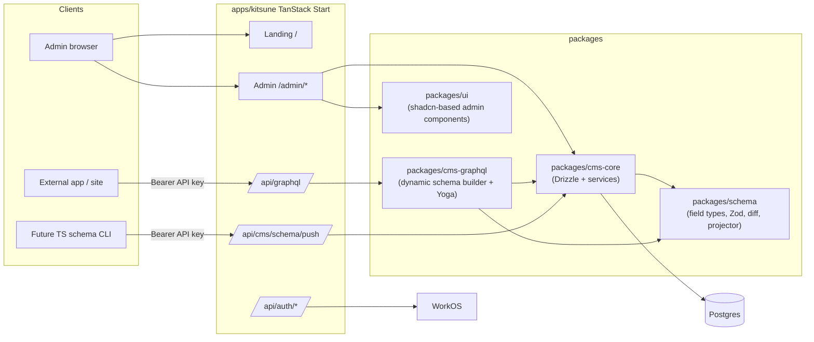
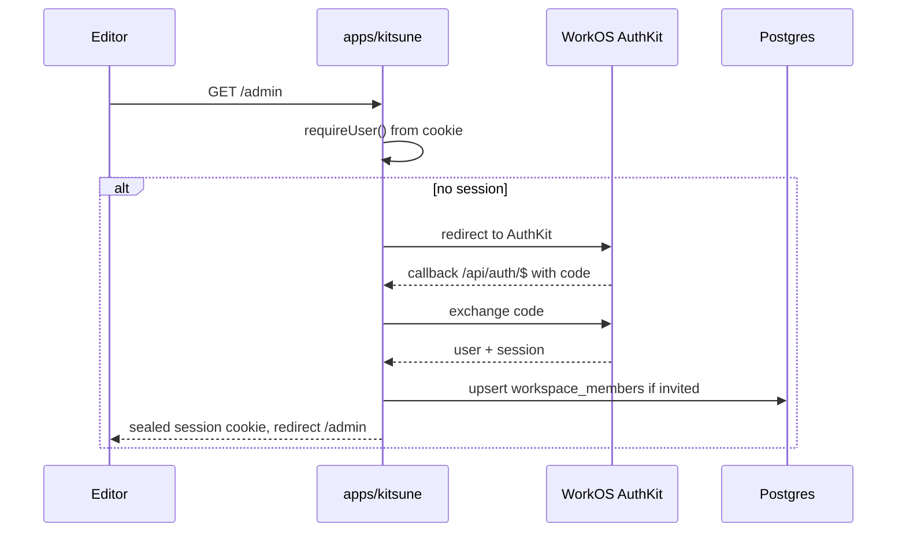
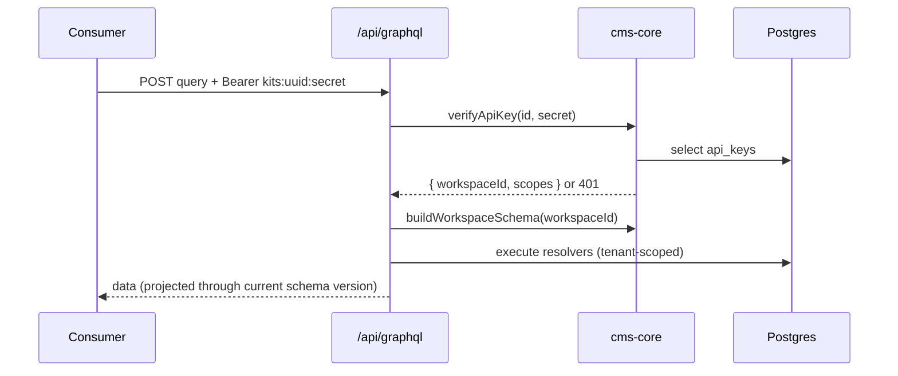

# Kitsune CMS MVP

## Target architecture

## Workspace layout

- [`apps/kitsune`](apps/kitsune) — thin composition: landing, `/admin/*`, `/api/auth/*`, `/api/graphql`, `/api/cms/*`. Imports from the packages below.
- `packages/schema` — pure TS, zero deps on DB. Field type registry, Zod compiler, schema diff + projector, locale helpers. Future CLI will depend only on this.
- `packages/cms-core` — Drizzle schema, migrations, tenant-scoped services (workspaces, collections, schema versions, documents, revisions, API keys, locales, assets), WorkOS session helpers.
- `packages/cms-graphql` — dynamic GraphQL schema builder (per workspace + schema-snapshot hash), LRU cache, Yoga adapter, API-key auth context.
- `packages/ui` — shadcn primitives + CMS-specific composites (FieldEditor, SchemaDesigner, MarkdownEditor, LocaleSwitcher, DocumentTable, ApiKeyCreateDialog).

Add `pnpm-workspace.yaml` globs are already correct; update `turbo.json` with `build`, `dev`, `lint`, `check-types`, `db:generate`, `db:migrate` pipelines and `packages/*` boundaries.

## Data model (Drizzle, Postgres)

All tenant-scoped rows carry `workspace_id` and are filtered via a `createTenantDb(workspaceId)` wrapper in `cms-core` to make accidental cross-tenant reads impossible at the service layer.

- `workspaces(id, slug, name, default_locale, created_at)`
- `workspace_members(workspace_id, user_id, role[owner|admin|editor|viewer])` — WorkOS user id as FK.
- `workspace_locales(workspace_id, code, label, is_default)` — seeded with `en`.
- `collections(id, workspace_id, slug, name, current_schema_version_id, created_at)` — unique `(workspace_id, slug)`.
- `collection_schema_versions(id, collection_id, version_number, fields jsonb, changeset jsonb, content_hash, created_by, created_at)` — immutable, unique `(collection_id, version_number)`. `fields` is validated by `packages/schema`.
- `documents(id, workspace_id, collection_id, schema_version_id, status[draft|published], published_at, data jsonb, created_by, updated_by, created_at, updated_at)` — GIN on `data`, btree on `(workspace_id, collection_id, status, updated_at)`.
- `document_revisions(id, document_id, revision_number, schema_version_id, data jsonb, status, created_by, created_at)` — append-only; `revision_number` unique per document.
- `api_keys` — finalize the shape already assumed by [`apps/kitsune/src/cms/api-key-service.ts`](apps/kitsune/src/cms/api-key-service.ts): `id uuid, workspace_id, name, key_prefix, secret_salt, key_hash, scopes jsonb, expires_at, revoked_at, last_used_at, created_by_user_id, created_at`. Extend `scopes` to include `write: boolean` and optional per-collection write allowlist.
- `assets(id, workspace_id, storage_key, mime, size, width?, height?, alt?, created_by, created_at)` — backed by a pluggable storage driver (local FS for dev, S3-compatible for prod; R2 works).

## `packages/schema` (no DB)

- Field type registry (string, text, markdown, number, boolean, date, select, reference, relation, array, object, asset). Each field declares `{ type, required?, default?, localized?, unique?, validators? }`.
- `compileZod(fields, { locale })` — builds a Zod schema for validation, respecting `localized` fields (produces `{ _i18n: Record<locale, T> }` for those).
- `diffSchemas(prev, next) -> Changeset` — detects `add`, `drop`, `rename` (when hints provided), `retype`, `defaultAdded`. Marks each change `destructive: boolean`.
- `project(data, fromVersion, toVersion, changesetChain, { locale, fallbackLocale })` — the read path. Applies renames, fills defaults, drops removed fields, fails soft on type narrowing. Also resolves localized fields to the requested locale with fallback.
- `contentHash(fields)` — stable hash for cache keys.

## `packages/cms-core` services

- `db.ts` — Drizzle client using `postgres.js` (or `pg`) with a single pooled connection; re-export a `createTenantDb(workspaceId)` helper that wraps every query builder with an implicit `eq(table.workspaceId, ...)` clause.
- `auth/workos.ts` — wrap `@workos-inc/authkit-session` (sealed cookie) for session read/write, login URL, callback handler, logout. Also a `requireUser()` helper for server functions.
- `auth/api-keys.ts` — move and finish [`apps/kitsune/src/cms/api-key-service.ts`](apps/kitsune/src/cms/api-key-service.ts) here. Wire `env.API_KEY_PEPPER` into [`apps/kitsune/src/env.ts`](apps/kitsune/src/env.ts). Add `write: boolean` + per-collection write scopes.
- `workspaces.ts` — create/list/switch workspace, invite member (via WorkOS Organizations), role checks.
- `collections.ts` — CRUD on collections.
- `schema-versions.ts` — `publishNewVersion(collectionId, nextFields, hints)`:
  1. Load `current` version.
  2. `diff = diffSchemas(current.fields, nextFields)` using rename/default hints.
  3. Reject if destructive parts aren't resolved (UI/CLI must resolve first).
  4. Insert new `collection_schema_versions` row, flip `collections.current_schema_version_id`.
  5. If destructive-with-resolution, enqueue a background rewrite job (simple `document_rewrite_jobs` table + a scheduled worker running inside TanStack Start on a timer, OR a lazy-on-read rewrite flag). MVP uses **lazy projection on read** + an explicit "Rewrite documents now" action in the UI that batches.
- `documents.ts` — create/update/list/get/publish/unpublish/revert. Every write:
  - validates against `current_schema_version` Zod,
  - inserts into `document_revisions` (next `revision_number`),
  - updates `documents` with `schema_version_id = current`.
  - On read: if stored `schema_version_id != current`, `project()` before returning; optionally persist the upgraded form if `status = draft`.
- `locales.ts` — CRUD on `workspace_locales`; ensure exactly one `is_default`.
- `assets.ts` — pluggable storage driver (`LocalFsDriver`, `S3Driver`); presigned uploads for S3.

## `packages/cms-graphql`

- `build-schema.ts` — `buildWorkspaceSchema(workspaceId)`:
  1. Load all collections + their `current_schema_version`.
  2. Compute a combined `snapshotHash = sha256(sorted contentHashes)`.
  3. If cached (LRU keyed by `${workspaceId}:${snapshotHash}`), return it.
  4. Otherwise, generate GraphQL types using `graphql` core:
     - One object type per collection named by `PascalCase(slug)` with fields (including nested objects and relations typed as references), plus `_id`, `_status`, `_publishedAt`, `_updatedAt`.
     - One `Query` field per collection: `{slug}(id, locale)` and `{slugPlural}(where, limit, offset, orderBy, locale, status)`.
     - Conditional `Mutation` fields (create/update/publish/delete) generated only if the request context has an API key with write scope for that collection.
  5. Localized fields resolve via `project()` using the `locale` argument and `workspace_locales.is_default` as fallback.
- `yoga.ts` — `createYoga({ schema: async ({ request }) => buildWorkspaceSchema(ctx.workspaceId) , context })`. Context is built from the `Authorization: Bearer` header via `parseBearerApiKey` + `verifyApiKey` from `cms-core`. Unknown/revoked keys → 401. Touch `last_used_at` on success (fire-and-forget).

## `packages/ui`

- Initialize shadcn in this package (root `components.json` at package root). Install `button`, `input`, `textarea`, `dialog`, `select`, `dropdown-menu`, `tabs`, `table`, `form`, `toast`, `command`, `badge`, `separator`.
- CMS composites:
  - `MarkdownEditor` — wrap `@uiw/react-md-editor` (live preview, tab-complete, no rich-text WYSIWYG); strictly Markdown in, Markdown out.
  - `FieldEditor` / `FieldRenderer` — dispatches on field type from `packages/schema`. Handles localized fields by showing a locale switcher and storing `_i18n.{locale}`.
  - `SchemaDesigner` — drag-reorder fields, add/rename/drop with confirmation that surfaces destructive changes (using `diffSchemas`).
  - `LocaleSwitcher`, `DocumentTable`, `ApiKeyCreateDialog` (shows the full key exactly once), `PublishBar` (draft/published state + last published timestamp + revert from revisions).

## `apps/kitsune` composition

- Add `packages/*` as dependencies via `workspace:*`. Strip orphan [`apps/kitsune/src/cms/api-key-service.ts`](apps/kitsune/src/cms/api-key-service.ts) (moves to `cms-core`).
- Env additions in [`apps/kitsune/src/env.ts`](apps/kitsune/src/env.ts): `DATABASE_URL`, `API_KEY_PEPPER`, `WORKOS_CLIENT_ID`, `WORKOS_API_KEY`, `WORKOS_REDIRECT_URI`, `WORKOS_COOKIE_PASSWORD`, optional `S3_*`. Mirror in [`apps/kitsune/.env.example`](apps/kitsune/.env.example).
- Routes (TanStack file-based):
  - `src/routes/index.tsx` — keep/upgrade landing.
  - `src/routes/login.tsx` — redirects to WorkOS AuthKit login URL.
  - `src/routes/api/auth/$.tsx` — AuthKit callback + logout.
  - `src/routes/api/graphql.tsx` — mounts Yoga from `cms-graphql`; accepts POST GraphQL and GET for GraphiQL (admin-only).
  - `src/routes/api/cms/schema.push.tsx` — accepts a CLI push payload, delegates to `cms-core` `schema-versions.publishNewVersion`.
  - `src/routes/admin/_layout.tsx` — requires WorkOS session + workspace; sidebar from `packages/ui`.
  - `src/routes/admin/index.tsx` — workspace dashboard.
  - `src/routes/admin/collections/index.tsx` — list/create.
  - `src/routes/admin/collections/$slug/schema.tsx` — `SchemaDesigner`.
  - `src/routes/admin/collections/$slug/index.tsx` — `DocumentTable`.
  - `src/routes/admin/collections/$slug/$id.tsx` — document editor with `FieldEditor`s + `MarkdownEditor` + `PublishBar` + revisions drawer.
  - `src/routes/admin/locales.tsx`, `src/routes/admin/members.tsx`, `src/routes/admin/api-keys.tsx`.
- Admin mutations use **TanStack Start server functions** (not GraphQL) for type-safe RPC into `cms-core`. GraphQL stays focused on headless delivery.

## Auth flows

## Phased delivery

1. **Foundation** — monorepo split, Drizzle + Postgres, migrations, env wiring, strip orphan file.
2. **`packages/schema`** — field registry, Zod compiler, diff, projector, tests.
3. **Auth** — WorkOS AuthKit integration + finish API-key service in `cms-core`.
4. **`cms-core` services** — workspaces, collections, schema versions, documents + revisions, locales, assets.
5. **`cms-graphql`** — dynamic schema builder + Yoga route, cached per `(workspace, snapshotHash)`.
6. **`packages/ui` + admin console** — schema designer, Markdown editor, document editor with i18n + publish + revisions, API keys UI, members, locales.
7. **Landing page polish + CLI push endpoint** — ship `POST /api/cms/schema/push` and document it so a later `@kitsune/cli` can drive schema changes.
8. **Hardening** — rate limits on GraphQL (per API key), GraphiQL locked to admins, health check, minimal seed for local dev.

## Vercel-readiness constraints baked in

- No runtime DDL, no shared in-process state beyond an LRU (keyed by `snapshotHash`, recomputable any time).
- Single pooled `postgres.js` client; all services accept an injectable `db` for cold-start-friendly instantiation.
- Blob storage behind a driver interface; sessions in sealed cookies (no server-side session store).
- Background work (rewrite jobs) expressed as idempotent row-by-row tasks triggered from the admin UI, easy to move to a queue later.