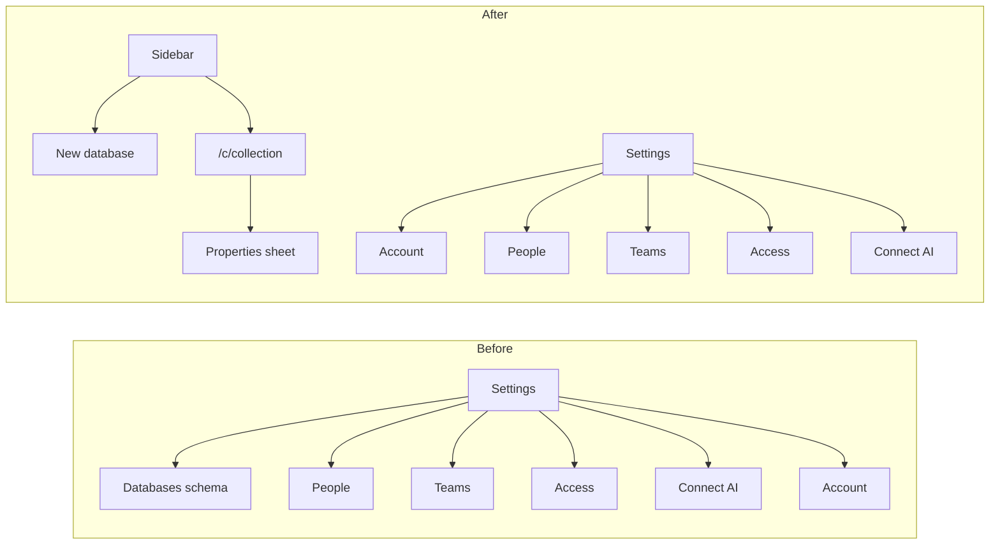

---
todos:
  - id: settings-nav
    status: completed
    content: 'Task 1: Settings nav without Databases; default to Account'
  - id: properties-sheet
    status: completed
    content: 'Task 2: Database Properties sheet on /c/[collection]'
  - id: create-db
    status: completed
    content: 'Task 3: Create-database dialog from sidebar/home'
  - id: retire-schema-settings
    status: completed
    content: 'Task 4: Retire /settings/schema and fix links'
  - id: docs
    status: in_progress
    content: 'Task 5: Update Notion/PRD docs + save plan file'
  - id: verify
    content: 'Task 6: Typecheck, Biome, manual smoke, push'
    status: pending
name: Notion Settings IA
overview: 'Strip all page/database content out of Settings and match Notion’s settings IA: Account, People, Teams, Access, Connect AI. Move schema/property editing and “new database” onto the database surface (`/c/[collection]` + sidebar).'
isProject: false
---
# Notion-like Settings (no pages/databases) Implementation Plan

> **For agentic workers:** REQUIRED SUB-SKILL: Use `superpowers:subagent-driven-development` (recommended) or `superpowers:executing-plans` to implement this plan task-by-task. Steps use checkbox (`- [ ]`) syntax for tracking.

**Goal:** Settings contains only workspace/account/org/integration controls — nothing about pages or databases — and database schema lives on the open database like Notion.

**Architecture:** Keep Settings as workspace chrome (People, Teams, Access, Connect AI, Account). Extract schema mutate UI from [`apps/app/src/app/(workspace)/settings/schema/page.tsx`](apps/app/src/app/(workspace)/settings/schema/page.tsx) into a Properties sheet on [`apps/app/src/components/collection/collection-view.tsx`](apps/app/src/components/collection/collection-view.tsx). Create-database moves to the sidebar/home empty state. Redirects retire `/settings/schema`.

**Tech Stack:** Next.js App Router (`apps/app`), existing `/api/schema` + `/api/schema/mutate`, shadcn Sheet/Dialog, Biome.

## Global Constraints

- Settings must not mention, list, create, or edit pages, databases, collections, columns, or properties.
- Settings tabs (exact): Account · People · Teams · Access · Connect AI.
- Default `/settings` lands on Account (`/settings/workspace`).
- Schema create/add/drop remains the same mutate API; only the UI home moves.
- Non-technical copy; no “schema/collection/principal” in user-facing strings on the new Properties UI.
- Update product docs that still say “Settings owns schema.”



## File map

| File | Responsibility |
|------|----------------|
| [`apps/app/src/components/settings/settings-nav.tsx`](apps/app/src/components/settings/settings-nav.tsx) | Tabs + subtitle without Databases |
| [`apps/app/src/app/(workspace)/settings/page.tsx`](apps/app/src/app/(workspace)/settings/page.tsx) | Redirect → Account |
| [`apps/app/src/app/(workspace)/settings/schema/page.tsx`](apps/app/src/app/(workspace)/settings/schema/page.tsx) | Delete or redirect away |
| [`apps/app/src/components/collection/database-properties-sheet.tsx`](apps/app/src/components/collection/database-properties-sheet.tsx) | **New** — add/remove properties for one database |
| [`apps/app/src/components/collection/create-database-dialog.tsx`](apps/app/src/components/collection/create-database-dialog.tsx) | **New** — create database (from sidebar/home) |
| [`apps/app/src/components/collection/collection-view.tsx`](apps/app/src/components/collection/collection-view.tsx) | Wire Properties control into table chrome |
| [`apps/app/src/components/shell/app-sidebar.tsx`](apps/app/src/components/shell/app-sidebar.tsx) | New database CTA (no `/settings/schema`) |
| [`apps/app/src/app/(workspace)/page.tsx`](apps/app/src/app/(workspace)/page.tsx) | Empty state create without Settings |
| [`apps/app/src/app/schema/page.tsx`](apps/app/src/app/schema/page.tsx) | Redirect → `/` or first collection |
| Docs: Notion console spec + PRD R8 wording | Settings no longer owns schema |

---

### Task 1: Settings nav — drop Databases, Notion tab set

**Files:**
- Modify: [`apps/app/src/components/settings/settings-nav.tsx`](apps/app/src/components/settings/settings-nav.tsx)
- Modify: [`apps/app/src/app/(workspace)/settings/page.tsx`](apps/app/src/app/(workspace)/settings/page.tsx)

**Interfaces:**
- Produces: Settings tabs = Account, People, Teams, Access, Connect AI only

- [ ] **Step 1: Rewrite nav tabs and copy**

```tsx
const TABS = [
  { href: '/settings/workspace', label: 'Account' },
  { href: '/settings/people', label: 'People' },
  { href: '/settings/teams', label: 'Teams' },
  { href: '/settings/access', label: 'Access' },
  { href: '/settings/connect', label: 'Connect AI' },
];
// subtitle: "Workspace account, people, access, and AI connections."
```

- [ ] **Step 2: Default Settings landing**

In `settings/page.tsx`: `redirect('/settings/workspace')` (not connect).

- [ ] **Step 3: Commit**

```bash
git add apps/app/src/components/settings/settings-nav.tsx apps/app/src/app/\(workspace\)/settings/page.tsx
git commit -m "feat(app): Notion-like Settings tabs without Databases"
```

---

### Task 2: Extract Properties sheet (schema UI on the database)

**Files:**
- Create: `apps/app/src/components/collection/database-properties-sheet.tsx`
- Modify: [`apps/app/src/components/collection/collection-view.tsx`](apps/app/src/components/collection/collection-view.tsx)
- Reuse mutate logic from [`settings/schema/page.tsx`](apps/app/src/app/(workspace)/settings/schema/page.tsx) (add field / drop field / reload via `/api/schema` + `/api/schema/mutate`)

**Interfaces:**
- Consumes: `collectionName: string`, existing `FieldMeta` shape from collection view
- Produces: `<DatabasePropertiesSheet collection={name} open onOpenChange />` that mutates properties for that database only

- [ ] **Step 1: Add failing / characterization check**

Manual gate (no e2e harness required): open `/c/{name}` → Properties → add a text property → column appears after reload.

- [ ] **Step 2: Implement sheet**

Port the per-collection add/drop UI from settings schema page into a Sheet titled **Properties**. User-facing labels: property (not field/column), database (not collection). Call `notifyWorkspaceChanged()` after successful mutate (same as schema page).

- [ ] **Step 3: Wire into collection toolbar**

Next to existing Columns / New page controls in `collection-view.tsx`, add a **Properties** button that opens the sheet for the current collection.

- [ ] **Step 4: Commit**

```bash
git add apps/app/src/components/collection/database-properties-sheet.tsx apps/app/src/components/collection/collection-view.tsx
git commit -m "feat(app): edit database properties on the collection view"
```

---

### Task 3: Create database outside Settings

**Files:**
- Create: `apps/app/src/components/collection/create-database-dialog.tsx`
- Modify: [`apps/app/src/components/shell/app-sidebar.tsx`](apps/app/src/components/shell/app-sidebar.tsx)
- Modify: [`apps/app/src/app/(workspace)/page.tsx`](apps/app/src/app/(workspace)/page.tsx)

**Interfaces:**
- Consumes: same `createCollection` mutate payload as today’s schema page
- Produces: dialog that on success navigates to `/c/{name}` and refreshes sidebar via `notifyWorkspaceChanged()`

- [ ] **Step 1: Implement create dialog**

Name input + Create; POST `/api/schema/mutate` with the existing create-collection action used by settings schema page.

- [ ] **Step 2: Replace sidebar “Create a database” link**

Change `/settings/schema` CTA to open the dialog (or a small client wrapper). Keep empty-state home create on the same dialog.

- [ ] **Step 3: Commit**

```bash
git add apps/app/src/components/collection/create-database-dialog.tsx apps/app/src/components/shell/app-sidebar.tsx apps/app/src/app/\(workspace\)/page.tsx
git commit -m "feat(app): create databases from sidebar, not Settings"
```

---

### Task 4: Retire Settings Databases route and redirects

**Files:**
- Delete or replace: [`apps/app/src/app/(workspace)/settings/schema/page.tsx`](apps/app/src/app/(workspace)/settings/schema/page.tsx) → `redirect('/')`
- Modify: [`apps/app/src/app/schema/page.tsx`](apps/app/src/app/schema/page.tsx) → `redirect('/')`
- Grep and fix any remaining `/settings/schema` links in app copy

- [ ] **Step 1: Redirect old URLs**

```tsx
// settings/schema/page.tsx and app/schema/page.tsx
import { redirect } from 'next/navigation';
export default function LegacySchemaRedirect() {
  redirect('/');
}
```

- [ ] **Step 2: Grep cleanup**

```bash
rg -n "settings/schema|Settings → Databases|add columns later in Settings" apps/app
```

Replace with Properties / sidebar create copy.

- [ ] **Step 3: Commit**

```bash
git commit -m "chore(app): remove Databases from Settings routes"
```

---

### Task 5: Docs + Access copy hygiene

**Files:**
- Modify: [`docs/superpowers/specs/2026-09-03-notion-console-ui-design.md`](docs/superpowers/specs/2026-09-03-notion-console-ui-design.md) — Settings owns people/access/integrations; schema on database
- Modify: [`docs/prd.md`](docs/prd.md) R8 (or equivalent) if it still says Settings owns schema
- Modify Access empty/help text only if it says “manage databases in Settings”

- [ ] **Step 1: Update IA sentences**

Settings = Account, People, Teams, Access, Connect AI. Database properties edit on `/c/[collection]`.

- [ ] **Step 2: Save this plan copy under docs**

Write/confirm plan at [`docs/superpowers/plans/2026-09-06-notion-settings-ia.md`](docs/superpowers/plans/2026-09-06-notion-settings-ia.md).

- [ ] **Step 3: Commit**

```bash
git commit -m "docs: Settings no longer owns database schema"
```

---

### Task 6: Verify

- [ ] **Step 1: Typecheck + Biome on touched files**

```bash
pnpm --filter @kitsuneos/app typecheck
pnpm exec biome check --write apps/app/src/components/settings apps/app/src/components/collection apps/app/src/app/\(workspace\)/settings
```

- [ ] **Step 2: Manual smoke**

1. `/settings` → Account; no Databases tab  
2. Sidebar create database → lands on `/c/...`  
3. Properties sheet add/remove property  
4. People / Teams / Access / Connect AI unchanged  
5. `/settings/schema` redirects home  

- [ ] **Step 3: Push PR branch**

---

## Spec coverage (self-review)

| Requirement | Task |
|-------------|------|
| Settings has nothing about pages/databases | 1, 4 |
| Notion-like settings structure | 1 (Account first + org + integrations) |
| Schema still editable | 2 |
| Create database still possible | 3 |
| Docs aligned | 5 |

No placeholders left; property sheet reuses existing mutate API shapes from the current schema page.
